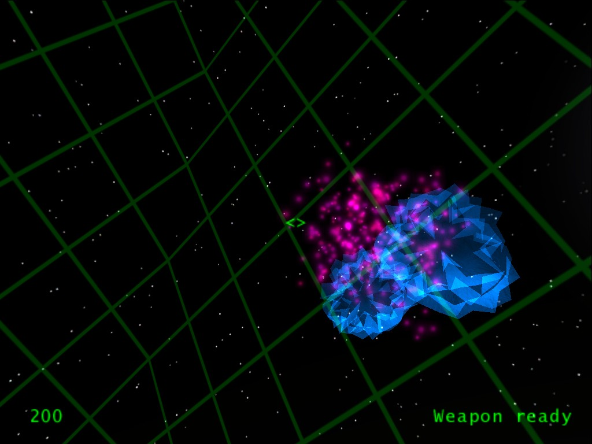
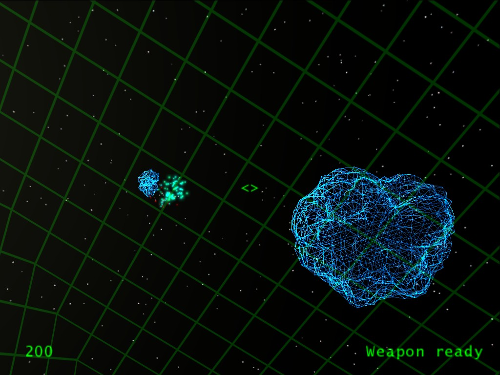

## Diplomarbeit "Game-Engine für eine 3D-Weltraumsimulation"

Meine Diplomarbeit von 2004 inkl. Sourcecode und dem ersten (und einzigen) Release. Es handelt sich dabei um eine Art "3D-Asteroids" mit ziemlich vielen Konfigurationsmöglichkeiten.

Dieses Repository dient als Archiv. Damals lief recht viel Aufwand in die Erstellung der Diplomarbeit, wäre schade, wenn die nur auf meiner Festplatte ihr Dasein weiter fristet. Irgendwann später werde ich das komplett neu implementieren.

Inhalt:
- Diplomarbeit.pdf
- src (Visual Studio 6.0 Sourcecode)
- ArP_1_0.zip (Release 1.0; lässt sich noch starten, läuft unter Windows 10 allerdings ziemlich instabil)

Diese Software ist unter der [GNU GPLv2](LICENSE.md) freigegeben.

Hier ein paar Screenshots:

